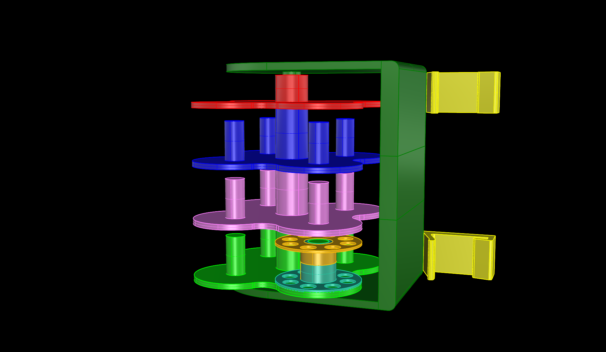
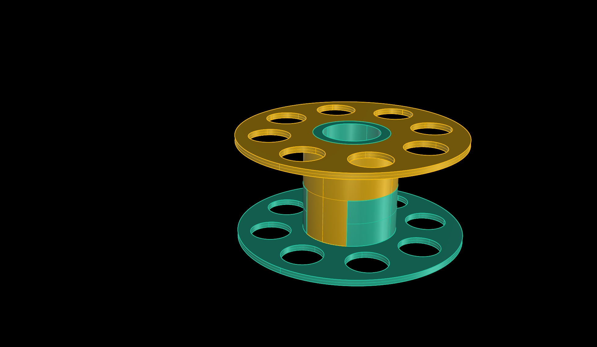
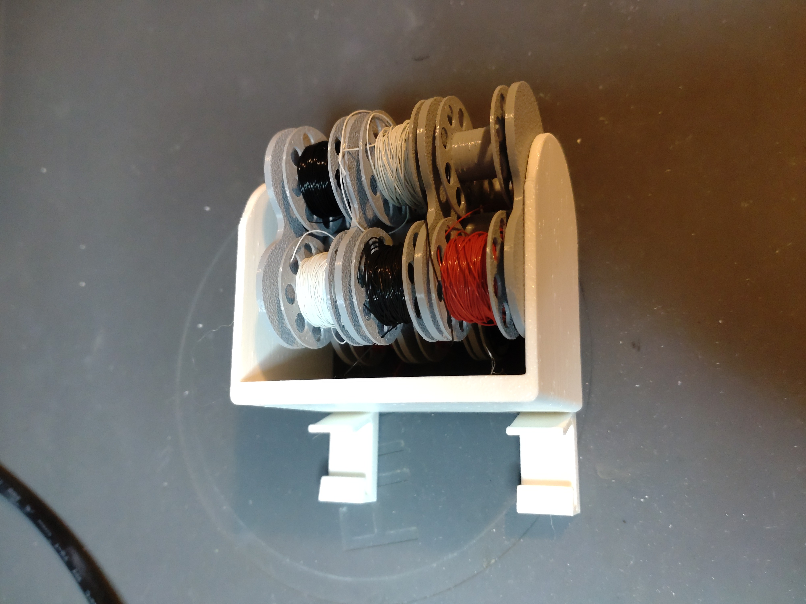
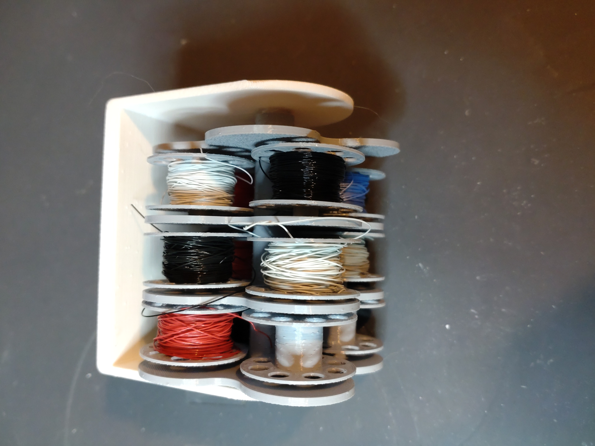
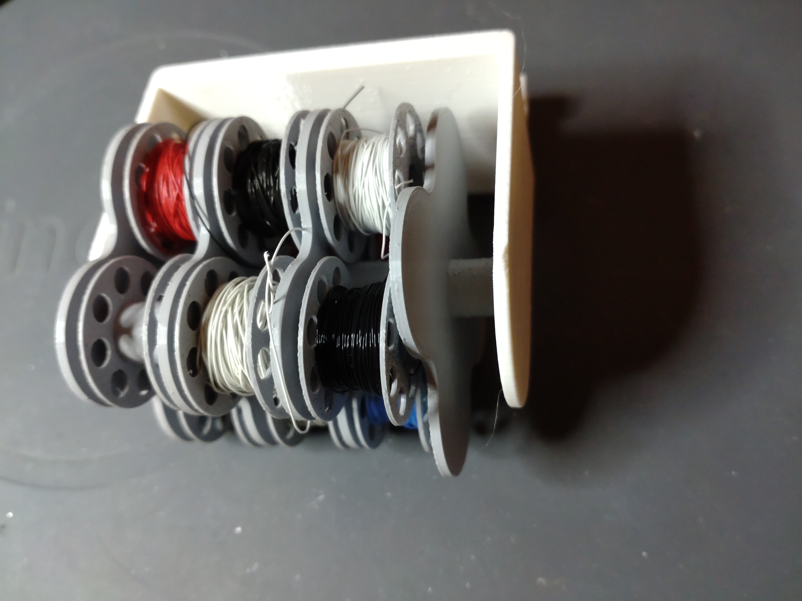

# Wire-Mini-Spool
3D printable mini spool and multi spool holder for 28-32 gauge wire. Created with Rhino 8.

I use it to sort cheap 28-32 gauge wire from ali which was delivered without spool.
There is a roundel for four spools and a holder for two or three roundels in a row. 
I clamped it to a shelf.

Requirements:
* 3D printer 
* Filament of your choice

## View

 

  

